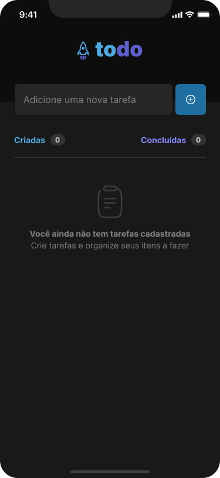

<h1 align="center" style="text-align: center;">
  
</h1>

<p align="center">
  <a href="#project">Projeto</a>&nbsp;&nbsp;&nbsp;|&nbsp;&nbsp;&nbsp;
  <a href="#technologies">Tecnologias</a>&nbsp;&nbsp;&nbsp;|&nbsp;&nbsp;&nbsp;
  <a href="#how-to-use">Como Usar</a>&nbsp;&nbsp;&nbsp;|&nbsp;&nbsp;&nbsp;
  <a href="#layout">Layout</a>
</p>


<div align="center">
 
</div>


<h2 id="project">📁 Projeto</h2>
O aplicativo consiste em uma lista de tarefas em que  usuário pudesse:

- adicionar tarefas;
- marcar ou desmarcá-la como concluída;
- deletar tarefas;
- contador de tarefas adicionadas;
- contador de tarefas concluídas.


<h2 id="project">🛠️ Tecnologias</h2>

- [React Native](https://reactnative.dev/)
- [Expo CLI](https://expo.dev/)
- [TypeScript](https://www.typescriptlang.org/)
- [Phosphor Icons](https://phosphoricons.com/)
- [Expo Checkbox](https://docs.expo.dev/versions/latest/sdk/checkbox/)


<h2 id="how-to-use">📱 Como usar</h2>

Você precisará ter o Expo CLI devidamente instalado e configurado na sua máquina.

Você pode verificar rodando o seguinte comando: 
```
$ expo --version 
```
Agora é só seguir o passo a passo:

1. Clone o projeto:

```
$ git clone https://github.com/gabjohann/todo
```

2. Acesse o repositório:

```
$ cd todo
```

3. Instale as dependências:

```
$ npm install
```

4. Inicie a aplicação:

```
$ expo start
```

Observação: você pode utilizar o gerenciador de pacotes da sua preferência, a fins de exemplo, utilizei o npm.


<h2 id="project">🎨 Layout</h2>

Você pode acessar o layout do projeto através deste [link](https://www.figma.com/file/1XfZQGSWk4HWjvwcjd2nOP/ToDo-List/duplicate), mas para isso você precisará de uma conta no Figma.

Feito com 🖤 by Lucas

